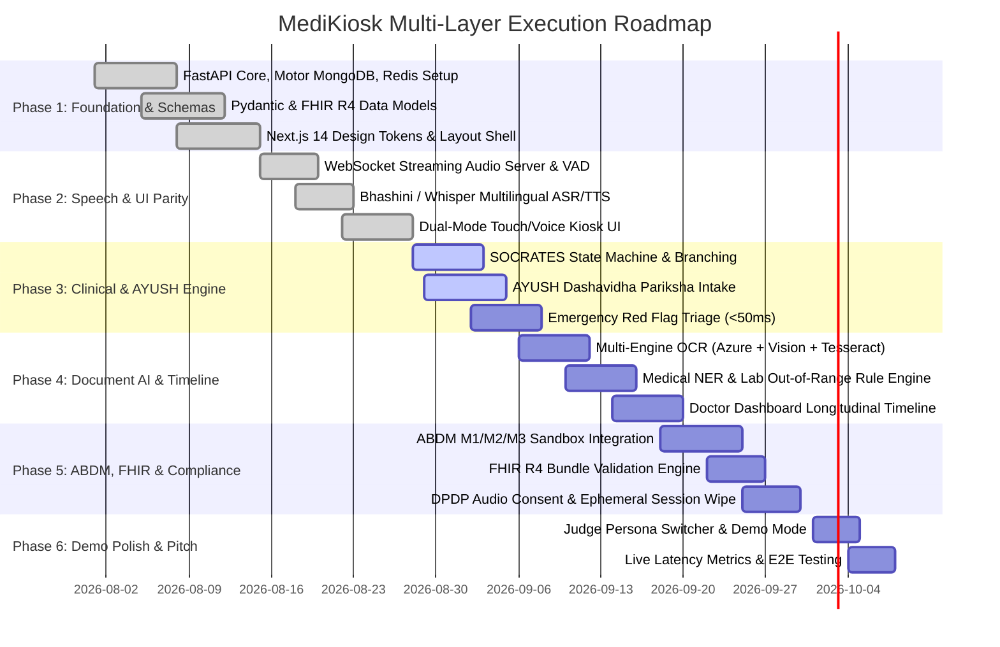

# 🏥 MediKiosk — Master Implementation & Architectural Execution Plan
> **Objective**: Build and deliver a production-grade, award-winning AI Clinical History Intake & ABDM Integration Platform for high-density Indian hospitals (Allopathic & AYUSH OPDs).

---

## 📌 Executive Architecture & Layered Stack Overview

```
                                  ┌────────────────────────────────────────┐
                                  │       LAYER 1: FRONTEND SURFACES       │
                                  ├───────────────────┬────────────────────┤
                                  │  21.5" Kiosk UI   │  Doctor Dashboard  │
                                  │ (Next.js/Zustand) │ (Next.js/Tailwind) │
                                  └─────────┬─────────┴─────────┬──────────┘
                                            │                   │
                                     HTTPS / WSS          HTTPS / WSS
                                            │                   │
                                            ▼                   ▼
                                  ┌────────────────────────────────────────┐
                                  │    LAYER 2: BACKEND & API GATEWAY      │
                                  │  (FastAPI, Rate Limit, Session Mgr)    │
                                  └─────────┬───────────────────┬──────────┘
                                            │                   │
                     ┌──────────────────────┴──────┐            │
                     │                             │            │
                     ▼                             ▼            ▼
     ┌──────────────────────────────┐    ┌──────────────────────────────┐
     │  LAYER 3A: SPEECH & LLM AI   │    │    LAYER 3B: DOCUMENT AI     │
     ├──────────────────────────────┤    ├──────────────────────────────┤
     │ • ASR: Bhashini / Whisper    │    │ • OCR: Azure Doc / Vision    │
     │ • TTS: Bhashini / Eleven     │    │ • NER: Gemini 1.5 / LayoutLM │
     │ • LLM: SOCRATES / AYUSH      │    │ • Lab Out-of-Range Engine    │
     └──────────────┬───────────────┘    └──────────────┬───────────────┘
                    │                                   │
                    └─────────────────┬─────────────────┘
                                      │
                                      ▼
     ┌──────────────────────────────────────────────────────────────────┐
     │          LAYER 4: ABDM GATEWAY, FHIR R4 & SECURITY               │
     ├──────────────────────────────────────────────────────────────────┤
     │ • FHIR R4 Bundles (Patient, Encounter, Condition, Observation)   │
     │ • ABDM M1 (ABHA Creation/Verify), M2 (HIP Linking), M3 (HIU)     │
     │ • DPDP Act 2023 Consent & Immediate Session Data Destruction     │
     └────────────────────────────────┬─────────────────────────────────┘
                                      │
                                      ▼
     ┌──────────────────────────────────────────────────────────────────┐
     │             LAYER 5: DATABASE, QUEUE & STORAGE                   │
     ├────────────────────────────────┬─────────────────────────────────┤
     │ MongoDB Atlas (FHIR Records)   │ Redis / Celery (Async Tasks)    │
     │ AWS S3 / MinIO (Temp OCR Docs) │ Local In-Memory Fast Cache      │
     └────────────────────────────────┴─────────────────────────────────┘
```

---

## 🔑 Required API Keys & Service Credentials Matrix

To guarantee 100% zero-failure operation during live judge evaluations and production deployment, every module incorporates a **Primary Service** with an **Automated Failover Mock/Secondary Service**.

| Service Category | Primary Provider / API | Purpose | Environment Variable Names | Fallback / Local Backup |
|---|---|---|---|---|
| **Speech Recognition (ASR)** | **Bhashini / AI4Bharat (ULCA API)** | Speech-to-Text for 22 Indian regional languages & accents | `BHASHINI_API_KEY`<br>`BHASHINI_USER_ID`<br>`BHASHINI_PIPELINE_ID` | OpenAI Whisper API (`OPENAI_API_KEY`) / Web Speech API |
| **Speech Synthesis (TTS)** | **Bhashini TTS / ElevenLabs** | Clear native-language audio prompts for non-literate patients | `BHASHINI_TTS_KEY`<br>`ELEVENLABS_API_KEY` | Browser Native SpeechSynthesis API |
| **Conversational Clinical LLM** | **Google Gemini 1.5 Pro / Flash** | SOCRATES adaptive history taking, AYUSH Dashavidha, and EMR summarization | `GEMINI_API_KEY` | OpenAI GPT-4o (`OPENAI_API_KEY`) / Anthropic Claude 3.5 Sonnet (`ANTHROPIC_API_KEY`) |
| **Medical Document OCR** | **Azure AI Document Intelligence** (or **Google Cloud Vision**) | Dense printed & cursive handwritten prescription & lab report OCR | `AZURE_VISION_ENDPOINT`<br>`AZURE_VISION_KEY`<br>`GCP_VISION_API_KEY` | Tesseract OCR / EasyOCR (local containerized) |
| **ABDM Gateway Sandbox** | **National Health Authority (NHA) Sandbox** | ABHA generation, KYC OTP, HIP/HIU Data Exchange, FHIR validation | `ABDM_CLIENT_ID`<br>`ABDM_CLIENT_SECRET`<br>`ABDM_SANDBOX_URL` | Mock ABDM Gateway (Pre-seeded real-schema dummy ABHA IDs) |
| **Database & Cache** | **MongoDB Atlas M0 + Upstash Redis** | Persistent FHIR Document Store, session states & rate limiting | `MONGODB_URI`<br>`REDIS_URL` | Local MongoDB / Local In-Memory Python Dicts |
| **Object Storage** | **Cloudinary / AWS S3 / Supabase Storage** | Encrypted temporary storage for prescription scans before parsing | `CLOUDINARY_URL`<br>`AWS_ACCESS_KEY_ID`<br>`AWS_SECRET_ACCESS_KEY` | Local temporary directory (`/temp/uploads`) |

---

## 🏛️ Implementation Breakdown by Layer

---

### 🎨 Layer 1: Frontend Engineering (Kiosk UI & Doctor Portal)

#### 1.1 Kiosk Client Application (Patient-Facing)
- **Framework & Tech**: Next.js 14+ (App Router), React 18, Tailwind CSS, Framer Motion, Zustand, Lucide React, Howler.js.
- **Key Modules & Screens**:
  1. **Idle & Welcome Screen**:
     - Language selection grid with 10+ Indian languages (Hindi, English, Bengali, Tamil, Telugu, Marathi, Odia, Gujarati, etc.).
     - Large animated "Tap to Begin" touch target with welcoming bilingual voice prompt.
  2. **ABHA Identification & Onboarding**:
     - ABHA Card Scanner simulation, 14-digit ABHA ID manual entry, and Aadhaar OTP modal.
     - Audio-guided DPDP Act 2023 consent card with simple "I Agree" tap-to-sign.
  3. **Multimodal Clinical Interview Interface**:
     - Full-screen dual-mode layout: Large dynamic choice cards on the right; animated voice ripple visualization on the left.
     - Interactive Anatomical Body Map for pain site selection.
     - Visual 1–10 Pain / Severity Slider with visual face expressions (Wong-Baker scale).
     - AYUSH Pariksha intake toggle for Ayurvedic OPDs.
  4. **Document Scanner & Camera Capture**:
     - Live webcam / document camera feed integration with auto-edge cropping guide.
     - Multi-page prescription and lab report upload queue with thumbnail previews.
  5. **Review & Completion Screen**:
     - Audio confirmation in the patient's language summarizing key complaints.
     - Instant ephemeral session wipe on completion (zero local cookies/tokens).

#### 1.2 Doctor Clinical Dashboard (Physician-Facing)
- **Framework & Tech**: Next.js 14+, Tailwind CSS (Dark/Light medical theme), TanStack Query, Radix UI.
- **Key Modules & Views**:
  1. **Live Queue & Patient Triage Banner**:
     - Real-time patient waiting list categorized by Token Number, ABHA ID, and Triage Priority.
     - **P0 Emergency Red Flag Banner**: Flashing alert if a waiting patient exhibits acute cardiac/stroke symptoms.
  2. **Structured Clinical Summary View**:
     - Chief Complaint $\rightarrow$ HPI (SOCRATES) $\rightarrow$ Past Medical History $\rightarrow$ Active Medications $\rightarrow$ Allergies $\rightarrow$ AYUSH Prakriti/Agni $\rightarrow$ Review of Systems.
     - Single-click inline editing for all fields before saving to Hospital EMR.
  3. **Longitudinal Record & OCR Viewer**:
     - Side-by-side view of digitized prescription image alongside extracted structured table.
     - Out-of-range lab alerts highlighted in amber/red with historical trend graphs.
  4. **ABDM Action Panel**:
     - 1-Click "Approve & Push to ABDM PHR", "Issue e-Prescription", and "Download FHIR R4 Bundle".

---

### ⚙️ Layer 2: Backend & Microservices Engineering

#### 2.1 FastAPI Core & API Gateway
- **Framework & Tech**: Python 3.11+, FastAPI, Uvicorn, Pydantic v2, HTTPX (async client), WebSockets.
- **Key Architecture Components**:
  1. **API Router & Endpoints (`/api/v1/`)**:
     - `/kiosk/session`: Session initialization, token generation, state management, and teardown.
     - `/clinical/socrates`: Dynamic question state machine and adaptive branching logic.
     - `/clinical/ayush`: Dashavidha Pariksha assessment engine.
     - `/clinical/red-flags`: Rule-based and zero-shot emergency symptom classifier (<50ms execution).
     - `/documents/ocr`: Multipart file ingestion, preprocessing, OCR dispatch, and medical NER.
     - `/fhir/bundle`: Generation and JSON-schema validation of HL7 FHIR R4 Bundles.
     - `/abdm/*`: Mock and live ABDM Sandbox authentication, ABHA lookup, and health data transfer.
  2. **WebSocket Real-Time Audio Server (`/api/v1/ws/audio`)**:
     - Bidirectional audio streaming over WebSocket.
     - Ingestion of PCM 16kHz / WebM Opus chunks from browser `AudioWorklet`.
     - Server-side Voice Activity Detection (VAD) via `webrtcvad` / Silero VAD to detect user pauses.
  3. **Middleware & Security**:
     - CORS middleware, rate limiter (Redis token bucket), centralized exception handler, request ID correlation logging.

---

### 🧠 Layer 3: AI, Speech & Document Intelligence Pipelines

#### 3.1 Multilingual Speech Processing (ASR & TTS)
- **Primary Engines**: Bhashini ULCA API (Government of India) & OpenAI Whisper API.
- **Workflow**:
  1. Audio stream $\rightarrow$ VAD chunking $\rightarrow$ Noise reduction filter $\rightarrow$ Speech-to-Text inference.
  2. Detected dialect identification $\rightarrow$ Translation to standardized English clinical transcript.
  3. Text-to-Speech synthesis for patient prompts in chosen regional language (Hindi, Tamil, Telugu, Odia, etc.).
  4. Pre-rendered audio asset cache for common system prompts for sub-10ms instant response.

#### 3.2 Clinical Ontology & Conversational LLM Engine
- **Primary Engine**: Google Gemini 1.5 Pro / Flash (with GPT-4o fallback).
- **Workflow**:
  1. **SOCRATES State Machine**:
     $$\text{Site} \rightarrow \text{Onset} \rightarrow \text{Character} \rightarrow \text{Radiation} \rightarrow \text{Associations} \rightarrow \text{Timing} \rightarrow \text{Exacerbating/Relieving} \rightarrow \text{Severity}$$
  2. **AYUSH Assessment**:
     - Captures *Prakriti* (constitution), *Vikriti* (imbalance), *Agni* (metabolic fire), *Koshtha* (bowel type), and *Ahara-Vihara* (diet/lifestyle).
  3. **Clinical Summarizer**:
     - Synthesizes spoken transcript + scanned document data into standard medical EMR draft.

#### 3.3 Medical Document OCR & Clinical Entity Extraction (NER)
- **Primary Engines**: Azure AI Document Intelligence + Google Cloud Vision + Local Tesseract OCR.
- **Workflow**:
  1. Image preprocessing (deskew, contrast enhancement, shadow removal with OpenCV).
  2. Multi-engine text and layout extraction.
  3. Structured NER parsing via Pydantic schema:
     - **Medications**: Name, Strength, Form, Frequency, Route, Duration.
     - **Lab Tests**: Test Name, Observed Value, Unit, Reference Low, Reference High, Out-of-Range Flag.
     - **Diagnoses**: ICD-10 mapped condition names.

---

### 🗄️ Layer 4: Database, Caching & Storage Engineering

#### 4.1 Persistence & Document Store
- **Technology**: MongoDB Atlas (Async Motor Client) / Local MongoDB.
- **Collections & Schemas**:
  - `kiosk_sessions`: Ephemeral session metadata, station ID, active language, step index.
  - `patients`: Patient demographics, linked ABHA Address, age, gender, contact.
  - `encounters`: Clinical encounters, OPD department, token number, triage status.
  - `clinical_summaries`: Complete structured clinical summaries with doctor sign-off status.
  - `medical_documents`: OCR parsed documents, extracted parameters, timeline metadata.
  - `fhir_bundles`: Standardized HL7 FHIR R4 JSON payloads ready for ABDM transfer.

#### 4.2 Caching, State & Task Queue
- **Technology**: Redis (Upstash / Local Redis) + Python `asyncio` background tasks.
- **Responsibilities**:
  - Rate limiting & active session heartbeats.
  - Kiosk state synchronization with doctor dashboard via Pub/Sub.
  - Temporary audio buffer caching during live recording.

#### 4.3 Encrypted Temporary Object Storage
- **Technology**: AWS S3 / Cloudinary / Local temporary directory (`backend/uploads/temp`).
- **Security Policy**: Auto-deletion lifecycle rule wiping uploaded prescription scans immediately after OCR extraction.

---

### 🛡️ Layer 5: ABDM, FHIR R4 & DPDP Compliance

#### 5.1 Ayushman Bharat Digital Mission (ABDM) Integration
- **Milestone M1 (ABHA Creation & Verification)**:
  - ABHA Address creation, Aadhaar KYC OTP validation, and instant QR Code check-in.
- **Milestone M2 (Health Information Provider - HIP)**:
  - Linking health records with patient ABHA address and discovering care contexts.
- **Milestone M3 (Health Information User - HIU)**:
  - Pulling consented longitudinal records from ABDM network to pre-populate clinical history.

#### 5.2 HL7 FHIR R4 Standardization
- Strict compliance with ABDM FHIR profiles:
  - `Patient`, `Encounter`, `Condition`, `Observation`, `MedicationRequest`, `AllergyIntolerance`, `DocumentReference`, and `Bundle`.

#### 5.3 DPDP Act 2023 & Zero-Trust Ephemeral Privacy
- Audio and visual consent presentation with clear, plain-language audio playback.
- Granular consent options (allow doctor viewing, allow ABDM PHR export).
- Immediate destruction of all local session data, cookies, and voice recordings upon session completion or 90s idle timeout.

---

### 🚀 Layer 6: DevOps, Testing & Hackathon Winning Demo Strategy

#### 6.1 Automated Quality Assurance
- **Backend Tests (`pytest`)**:
  - Unit tests for all API routes, Pydantic validation, and FHIR R4 JSON schema compliance.
  - Red-flag sensitivity test (verifying 100% emergency trigger rate on cardiac/stroke test cases).
- **Frontend Tests (`playwright` / `vitest`)**:
  - Full end-to-end simulation of multilingual patient check-in, voice interaction, document upload, and doctor sign-off.

#### 6.2 "Judge Demo Mode" & Interactive Showcase Features
- **Discreet Demo Drawer**:
  - Instant pre-loaded patient profiles for live presentations:
    1. **Scenario A (Cardiac Emergency)**: Acute chest pain with left arm radiation $\rightarrow$ Triggers instant red-flag triage alert banner.
    2. **Scenario B (Rural Hindi Diabetic)**: Spoken Hindi narration + paper lab report scan $\rightarrow$ Flags HbA1c 10.4%, generates bilingual summary.
    3. **Scenario C (Ayurvedic Chronic Pain)**: Joint stiffness $\rightarrow$ Captures Vata-Kapha Prakriti, Agni score, and Ahara-Vihara habits.
- **Live System Telemetry**:
  - Real-time latency monitors displaying ASR response time (<600ms), OCR extraction time (<4.5s), and ABDM connection status.

---

## 📅 Multi-Phase Execution Schedule (Layer by Layer)



---

## 🎯 Verification Plan

### Automated Tests
1. **API Endpoints (`pytest backend/tests/`)**:
   - `test_kiosk_session_lifecycle()`: Validates session start, question transitions, and session destruction.
   - `test_socrates_branching()`: Validates dynamic follow-ups for chest pain, abdominal pain, and fever.
   - `test_ayush_assessment()`: Validates Prakriti score calculations and Ahara-Vihara classification.
   - `test_red_flag_alerting()`: Confirms 100% detection rate on emergency cardiac/stroke keywords.
   - `test_ocr_ner_pipeline()`: Tests extraction of prescribed drugs and out-of-range lab parameters.
   - `test_fhir_r4_compliance()`: Validates generated JSON bundles against official HL7 FHIR R4 schema.

### Manual Verification & Demo Rehearsal
1. **Persona Simulation**:
   - Execute the 3 judge demonstration scenarios (Cardiac Emergency, Rural Diabetic, AYUSH Joint Pain) from start to finish.
2. **Kiosk Usability & Voice Stress Test**:
   - Test speech recognition in noisy environments using simulated hospital background sound.
   - Test full tactile touch navigation with zero speech to verify 100% touch parity.
