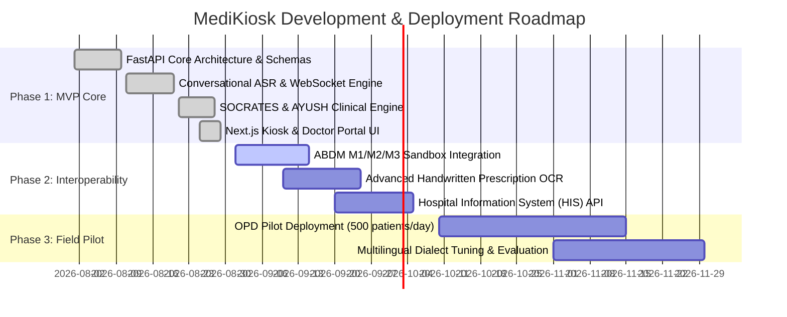

# Product Requirements Document (PRD) — MediKiosk

| **Document Version** | 1.0.0 |
|---|---|
| **Product Name** | MediKiosk (AI Clinical History Intake & ABDM Integration Platform) |
| **Target Track** | Smart India Hackathon (SIH) / Apex Public Health & AYUSH Hospital Ingestion |
| **Status** | Active / In Development |
| **Primary Target Audience** | Patients (Outpatient Departments - OPD), Triage Nurses, OPD Physicians, AYUSH Practitioners, Hospital Administrators |

---

## 1. Executive Summary & Problem Overview

### 1.1 Context
Tertiary and apex government hospitals in India handle between 4,000 and 10,000 Outpatient Department (OPD) registrations daily. With a physician-to-patient ratio heavily strained, average clinical consultation times range from **2 to 5 minutes per patient**.

Within this narrow window, physicians must:
1. Elicit a multi-system clinical history (Chief Complaint, HPI, Past/Drug/Allergy history, Family/Personal history).
2. For AYUSH hospitals: Assess Ayurvedic *Dashavidha / Ashtavidha Pariksha* (Prakriti, Vikriti, Agni, Koshtha, Ahara-Vihara).
3. Decipher, organize, and inspect physical paper records (handwritten prescriptions, lab reports, imaging slips).
4. Perform physical examinations, diagnose, counsel, and generate prescriptions.

The result is systematic under-elicitation of history, diagnostic fatigue, missed comorbidities/drug interactions, and severe record fragmentation.

### 1.2 The MediKiosk Solution
**MediKiosk** is an AI-powered, multimodal, self-service clinical intake platform designed for high-throughput Indian public hospital waiting areas and OPD foyers. It shifts structured clinical history intake and paper document digitization to the "first mile" (pre-consultation), converting free-form multimodal patient input into structured, physician-ready FHIR R4 clinical summaries linked to the patient’s Ayushman Bharat Health Account (ABHA).

```
   ┌─────────────────────────────────────────────────────────────┐
   │                  1. MULTIMODAL INTAKE                       │
   │  - Multilingual Speech (ASR/TTS in 22 Scheduled Languages)  │
   │  - High-Contrast Touch / Icon-Driven Dual Mode UI           │
   │  - Audio-guided DPDP Act 2023 Consent & ABHA Verification   │
   └──────────────────────────────┬──────────────────────────────┘
                                  │
                                  ▼
   ┌─────────────────────────────────────────────────────────────┐
   │             2. CLINICAL & AYUSH AI ENGINE                   │
   │  - Dynamic SOCRATES History Elicitation Framework           │
   │  - AYUSH Dashavidha Pariksha & Ahara-Vihara Profiling       │
   │  - Instant Red Flag Alerting for Emergency Triage           │
   │  - Multilingual OCR + NER for Lab & Prescription Timelines  │
   └──────────────────────────────┬──────────────────────────────┘
                                  │
                                  ▼
   ┌─────────────────────────────────────────────────────────────┐
   │               3. PHYSICIAN CLINICAL SUMMARY                 │
   │  - Formatted EMR Summary (Draft for Doctor Approval)        │
   │  - ABDM Milestones M1/M2/M3 & FHIR R4 Bundle Export         │
   │  - Zero-Trust Session Destruction on Kiosk                  │
   └─────────────────────────────────────────────────────────────┘
```

---

## 2. Target User Personas & Core Workflows

### 2.1 User Personas

| Persona | Role | Key Needs & Pain Points |
|---|---|---|
| **1. Rural / Elderly Patient (Ramesh)** | Low-literacy or first-time OPD visitor | Cannot navigate complex text apps; prefers speaking in native dialect (e.g., Bhojpuri/Hindi); carries disordered paper documents. |
| **2. High-Throughput Physician (Dr. Priya)** | Government Tertiary Hospital OPD Doctor | Has <3 minutes per patient; needs concise, structured history, abnormal lab flags, and chronological prior Rx before patient sits down. |
| **3. AYUSH Practitioner (Vaidya Sharma)** | Ayurvedic OPD Physician | Needs extensive constitution (*Prakriti*), digestive capacity (*Agni*), and lifestyle (*Ahara-Vihara*) data without consuming entire consultation. |
| **4. Triage Nurse / Hospital Admin (Sister Mary)** | OPD Waiting Room Supervisor | Requires immediate automated red-flag alerts (e.g., chest pain, stroke signs) to divert emergency patients to casualty. |

---

## 3. Product Architecture & Core Modules

### 3.1 Module A: Conversational Multimodal History Engine
- **Voice-First & Touch-First Parity**: Every screen and question is simultaneously interactable via spoken voice or large-target touch icons.
- **Adaptive SOCRATES Branching**:
  - **Site**: Anatomical localization with tap-to-pin body diagram.
  - **Onset**: Sudden vs. gradual symptom onset.
  - **Character**: Sharp, dull, burning, aching, colicky.
  - **Radiation**: Referred pain mapping (e.g., left arm/jaw for chest pain).
  - **Associations**: Concomitant symptoms (sweating, breathlessness, nausea, fever).
  - **Time course**: Duration, frequency, diurnal variation.
  - **Exacerbating/Relieving**: Effect of exertion, posture, meals, rest.
  - **Severity**: 1–10 visual analog and spoken rating scale.
- **AYUSH Mode**:
  - *Dashavidha Pariksha* (Prakriti, Vikriti, Sara, Samhanana, Pramana, Satmya, Sattva, Ahara Shakti, Vyayama Shakti, Vaya).
  - *Ahara-Vihara* (Dietary habits, bowel regularity, sleep cycle, stress triggers).
- **Emergency Red Flag Detection**:
  - Identifies acute coronary syndromes, acute stroke, respiratory distress, shock, high fever with altered sensorium.
  - Generates instant audiovisual alert on the kiosk and pushes emergency triage flag to the OPD Nurse station.

### 3.2 Module B: Medical Document Digitization & Intelligence
- **Intelligent Optical Character Recognition (OCR)**:
  - Supports printed and handwritten prescriptions, laboratory reports, discharge summaries, and radiology findings in multiple regional scripts.
- **Clinical Entity Extraction (NER)**:
  - Diagnoses, prescribed medications (active ingredient, strength, dosage, frequency), lab parameters, reference ranges, and surgical procedures.
- **Abnormal Value Flagging**:
  - Automatically compares extracted lab values against standard age/gender reference ranges (e.g., HbA1c > 9.0, Creatinine > 2.5, Troponin positive).
- **Chronological Timeline Generation**:
  - Organizes fragmented historical documents into a dated longitudinal care timeline.

### 3.3 Module C: Structured History Summary Generator (Doctor Portal)
- **Standard Clinical Structure**:
  $$\text{Chief Complaint} \rightarrow \text{HPI (SOCRATES)} \rightarrow \text{Past Hx} \rightarrow \text{Drug/Allergy} \rightarrow \text{Family/Personal} \rightarrow \text{ROS} \rightarrow \text{Prior Labs/Rx}$$
- **Physician Decision-Support Role**:
  - The AI summary is strictly presented as a **draft** for the physician to review, amend, or reject. It never generates autonomous clinical decisions.
- **Bilingual Interface**:
  - Patient confirms audio synthesis in native vernacular language; physician reviews structured medical English or bilingual summary.

### 3.4 Module D: ABDM, FHIR R4 & DPDP Act 2023 Compliance
- **ABHA Identification**:
  - Supports 14-digit ABHA Number lookup, ABHA Address (`@abdm`), Aadhaar OTP authentication, and QR code check-in.
- **FHIR R4 Standardized Bundles**:
  - Generates standard FHIR resources: `Patient`, `Encounter`, `Condition`, `Observation`, `MedicationRequest`, `AllergyIntolerance`, `DocumentReference`.
- **DPDP Act 2023 & Consent Architecture**:
  - Audio-guided consent flow in the patient’s chosen language explaining what data is captured and how it will be shared with the consulting doctor.
  - Granular, revocable consent.
  - Ephemeral kiosk storage: Complete local cache wipe upon session completion or 2-minute inactivity timeout.

---

## 4. Functional Requirements Matrix

| ID | Feature / Requirement | Description | Priority |
|---|---|---|---|
| **FR-01** | Multilingual Language Selection | Support top Indian languages (Hindi, English, Bengali, Tamil, Telugu, Marathi, Kannada, Odia, Gujarati, Punjabi) with audio prompt. | **P0 (Must Have)** |
| **FR-02** | ABHA Identification & Verification | OTP / QR scanning / Manual entry of ABHA ID via ABDM Gateway. | **P0 (Must Have)** |
| **FR-03** | DPDP Act Audio-Guided Consent | Visual + Audio consent disclaimer; explicit digital signature / tap acceptance. | **P0 (Must Have)** |
| **FR-04** | Multimodal Conversational History | Live speech audio streaming via WebSocket with fallback to touch choice cards. | **P0 (Must Have)** |
| **FR-05** | Adaptive SOCRATES Elicitation | Dynamic follow-up question generation tailored to chief complaints. | **P0 (Must Have)** |
| **FR-06** | AYUSH Pariksha Assessment | Dedicated toggle for Ayurvedic OPD intake (Prakriti, Vikriti, Agni, Koshtha). | **P1 (Should Have)** |
| **FR-07** | Red Flag Emergency Detection | Real-time pattern matching for triage bypass & emergency station notification. | **P0 (Must Have)** |
| **FR-08** | Document Scan & OCR Processing | Multi-page image/PDF upload, OCR text parsing, and medical NER extraction. | **P0 (Must Have)** |
| **FR-09** | Out-of-Range Lab Highlighting | Automated threshold comparison highlighting critical laboratory abnormalities. | **P1 (Should Have)** |
| **FR-10** | Longitudinal Timeline | Chronological ordering of prior visits, prescriptions, and lab tests. | **P1 (Should Have)** |
| **FR-11** | Doctor Summary Dashboard | Clean web portal displaying structured summary, flagged risks, and editable notes. | **P0 (Must Have)** |
| **FR-12** | FHIR R4 Bundle Construction | Exporting encounter and clinical observations as validated ABDM FHIR JSON. | **P0 (Must Have)** |
| **FR-13** | Auto-Session Wipe | Zero-trust destruction of local cookies, tokens, and audio blobs after finish. | **P0 (Must Have)** |

---

## 5. Non-Functional Requirements (NFR)

### 5.1 Performance & Latency
- **Speech-to-Text (ASR) Latency**: $\le 600\text{ ms}$ chunk response time over WebSocket.
- **LLM Elicitation & Summary Generation**: $\le 1.8\text{ seconds}$ per conversational turn.
- **Document OCR & NER Processing**: $\le 4.5\text{ seconds}$ for a standard 2-page prescription/lab report.
- **Doctor Portal Load Time**: $\le 400\text{ ms}$ upon patient token call.

### 5.2 Accessibility & Usability
- **Touch Target Size**: Minimum $48 \times 48\text{ px}$ (optimized for $64 \times 64\text{ px}$ on 21.5" kiosk touchscreens).
- **Color Contrast**: WCAG 2.1 AA compliant (minimum 4.5:1 for standard text, 7:1 for vital metrics).
- **Audio Clues**: Text-to-speech auto-prompts on all interactive steps for illiterate patients.

### 5.3 Security, Privacy & Data Governance
- **Encryption**: TLS 1.3 in transit; AES-256 for document blobs and database records at rest.
- **Data Minimization**: Voice audio files are deleted after ASR transcription; only anonymized text tokens and structured clinical schemas persist.
- **Authentication**: Role-based access control (RBAC) for Doctors (HMIS/EHR credentials) and Kiosk Station IDs.

---

## 6. Data Model & FHIR Standards Alignment

MediKiosk maps all internal schemas to standard **HL7 FHIR Release 4 (R4)** compliant profiles as specified by ABDM:

```
                  ┌────────────────────────┐
                  │      FHIR Bundle       │
                  │   (type: "document")   │
                  └───────────┬────────────┘
                              │
         ┌────────────────────┼────────────────────┐
         │                    │                    │
         ▼                    ▼                    ▼
┌─────────────────┐  ┌─────────────────┐  ┌─────────────────┐
│ Patient         │  │ Encounter       │  │ Condition       │
│ - ABHA Number   │  │ - Status        │  │ - Chief Compl.  │
│ - Demographics  │  │ - Class (OPD)   │  │ - SNOMED CT     │
└─────────────────┘  └─────────────────┘  └─────────────────┘
         │                    │                    │
         ▼                    ▼                    ▼
┌─────────────────┐  ┌─────────────────┐  ┌─────────────────┐
│ Observation     │  │ MedicationReq   │  │ DocumentRef     │
│ - SOCRATES / ROS│  │ - Active Drugs  │  │ - Scanned Rx    │
│ - AYUSH Prakriti│  │ - Dosages       │  │ - Lab PDF OCR   │
└─────────────────┘  └─────────────────┘  └─────────────────┘
```

---

## 7. Metrics & Key Performance Indicators (KPIs)

| Metric Category | Target KPI | Measurement Method |
|---|---|---|
| **Clinical Efficiency** | $\ge 60\%$ reduction in history-taking time per doctor | Average consultation time pre- vs. post-deployment |
| **Kiosk Throughput** | $3.5\text{ to }5\text{ minutes}$ total intake time per patient | Timestamp delta from check-in to summary generation |
| **OCR Accuracy** | $\ge 90\%$ entity accuracy on printed reports; $\ge 75\%$ on handwritten Rx | Doctor manual correction rate in doctor portal |
| **Patient Independence** | $\ge 70\%$ of patients complete intake without volunteer assistance | Triage staff intervention telemetry |
| **ABHA Linkage** | $\ge 85\%$ successful ABHA verification/linking rate | Percentage of generated FHIR bundles linked to active ABHA |

---

## 8. SIH Milestone & Implementation Roadmap


